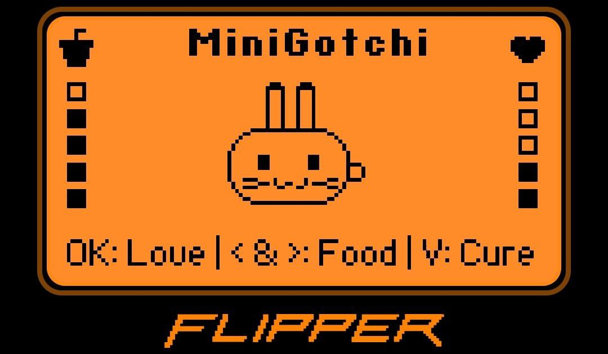

# MiniGotchi — A Tamagotchi-like pet for Flipper Zero



## English Version

### Description

MiniGotchi is a virtual pet that runs directly on the Flipper Zero.  
It started as a learning and experimentation project and evolved into a simple game, but designed to be extensible and maintainable.

---

## Architecture Overview

The project is structured into independent domains:

- Core: game logic and persistent state management
- UI: drawing and animations
- App Layer: Flipper OS integration, GUI, input loop
- Persistence: saves data in apps_data so the pet's state survives between executions
- Assets: static sprites

---

## Installation

Requires:
- Flipper Zero
- Official firmware or a compatible custom firmware
- Firmware repository cloned and build environment configured

Place the MiniGotchi project into:

```
applications_user/minigotchi
```

Build:

```bash
./fbt fap_minigotchi
```

The `.fap` file will be generated in:

```
build/f7-firmware-D/.extapps/minigotchi.fap
```

Copy it to the Flipper in:

```
SD Card/apps/Games/
```

Run on Flipper:

```
Apps → Games → MiniGotchi
```

---

## Current Features

- Animated virtual pet
- Pet interaction 
- Emotional changes
- Feeding system  
- Gradual hunger levels based on real time using RTC
- Gradual emotional deprivation based on real time using RTC 
- Persistent save stored in apps_data
- Real-time based aging
- Sleep cycle (automatic sleep during night)
- Death system
- Illness system
  
---

## Upcoming Features

- Emotion system with intensity levels
- Extended persistence with statistics
- New animations and expressions

---

# Versão em Português

## Descrição

O MiniGotchi é um bichinho virtual que roda diretamente no Flipper Zero.  
Nasceu como um projeto de aprendizado e hoje é um jogo simples, mas projetado para crescer de forma organizada.

---

## Visão Geral da Arquitetura

O projeto é organizado em domínios independentes:

- Core: lógica do jogo e estado persistente
- UI: desenho e animações
- App Layer: integração com o Flipper OS, GUI e loop de input
- Persistência: salva dados no apps_data para manter estado do pet
- Assets: sprites estáticos

---

## Como Instalar no Flipper Zero

Requisitos:
- Flipper Zero
- Firmware oficial ou custom compatível
- Repositório do firmware clonado e ambiente configurado

Coloque o projeto em:

```
applications_user/minigotchi
```

Compile:

```bash
./fbt fap_minigotchi
```

O `.fap` será gerado em:

```
build/f7-firmware-D/.extapps/minigotchi.fap
```

Envie para o Flipper:

```
SD Card/apps/Games/
```

No Flipper:

```
Apps → Games → MiniGotchi
```

---

## Funcionalidades Atuais

- Bichinho virtual animado
- Interação com o bichinho
- Mudanças emocionais
- Sistema de alimentação  
- Nível de fome gradual baseado em tempo real (RTC)  
- Nível de carência gradual em tempo real (RTC)  
- Salvamento persistente em apps_data
- Envelhecimento baseado em tempo real (RTC)
- Ciclo de sono (dorme automaticamente a noite)
- Sistema de falecimento
- Sistema de adoecimento

---

## Próximas Funcionalidades

- Sistema de emoções com níveis
- Persistência estendida com estatísticas
- Novas animações e expressões

---

## Contributions / Contribuições

Pull Requests are welcome =D  
Sugestões e contribuições são muito bem-vindos =D

---

## License / Licença

GPLv3
